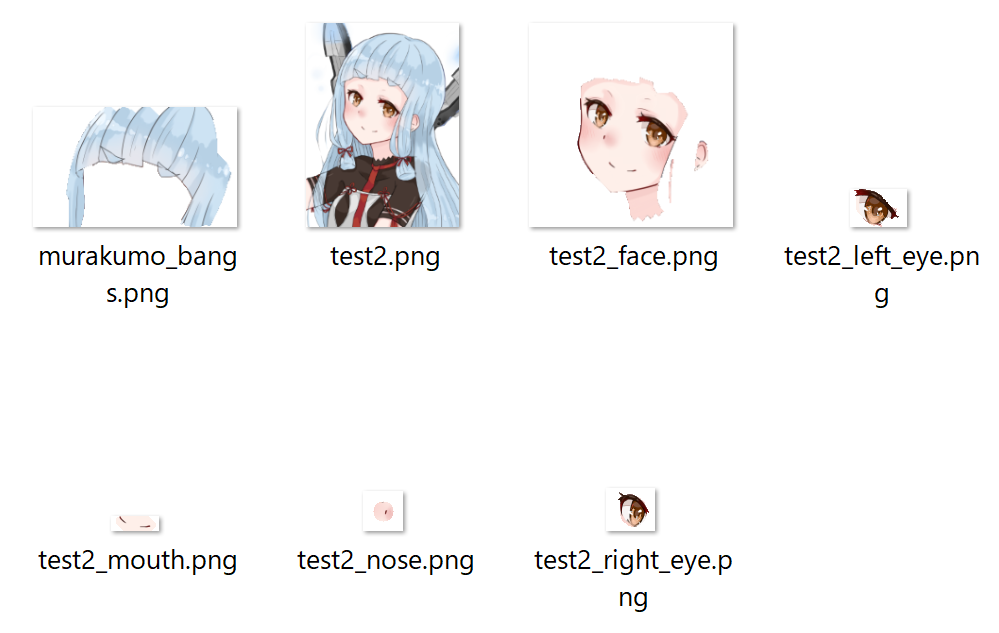

# キャラクター画像の顔パーツ自動分割

## 概要
Live2D制作の前準備である、キャラクター画像の"顔パーツをそれぞれのレイヤーに分割する"という作業を効率化するためのツールを作成しました。

### 作成したツールを用いてLive2Dでイラストを動かした様子
このツールを用いて以下の画像の顔パーツをそれぞれ切り取り、Live2D制作をした様子を以下に示します。
眉毛や二重線など、このツールで細かく切り取りができなかった部分は、Clip Studioで手動で切り取りを行いました。  
作成したツールを用いることによって、数日単位で作業効率が向上しました。　　

 

## 目的
Live2Dを制作するためには、キャラクターイラストの目、口、髪の毛、などのパーツを予め別レイヤーに分割して用意しておかなくてはいけません。しかし、レイヤー分けしていない既存の画像をLive2Dに取り込んで動かしたい場合には、手作業でパーツごとにレイヤー分けをする必要があります。その作業はとても時間がかかり、面倒であるため、このツールにより、対話的前景領域抽出のgrabcutのアルゴリズムとアニメ画像の顔認識のプログラムをベースとして、目、鼻、口などの顔パーツを認識し、自動で切り取りを行うことを目的としました。

## 機能一覧
- grabcut_auto - [grabcutのプログラム](https://github.com/opencv/opencv/blob/master/samples/python/grabcut.py) をベースに作成したプログラム[grabcut_manual.py](https://github.com/Ri-tanaka/grabcut_manual)に顔認識の機能を追加しました。
    - マウスで描写することによって、前景領域と背景領域を選択する機能
    - 顔パーツ(右目、左目、鼻、口、前髪、顔)を顔認識によって認識し、前景領域抽出を行う機能  
    - 出力画像をクロップして、それぞれのパーツごとの名前を付けて透過で保存する機能  
    - 目の切り取りを選択後、白目部分も切り取り可能に  
    - 鼻の自動切り取り  

- landmark.py - [アニメ顔用のランドマーク検出プログラム](https://github.com/kanosawa/anime_face_landmark_detection) をベースとして、検出した顔ランドマークの座標をもとに、それぞれのパーツごとの座標設定を追加しました。
    - 右目、左目、鼻、口、顔、前髪それぞれの座標設定
    - 矩形で囲む座標4点を設定

## デモリールと使い方
#### デモリール：grabcut_auto.pyを実行し、右目、左目、鼻、口、前髪の前景領域抽出を行っている様子

#### 出力結果：パーツごとにクロップして保存されたファイル
  

#### 使い方
コマンドラインにて以下を入力します。抽出する顔パーツは"right_eye", "left_eye", "nose", "mouth", "face", "bangs"のうちのどれかを選んで入力します。顔パーツを選択しないで実行した場合、デフォルトで右目が選択されます。
    `python grabcut_auto.py <画像ファイル名> <抽出する顔パーツ>`   
    
    1.入力ウィンドウと出力ウィンドウが開きます。  
    2.入力ウィンドウ上で、抽出する顔パーツが矩形で囲まれます。  
    3.'n'を数回押すことによって前景抽出を行います。  
    4.以下のキーを入力し、前景領域と背景領域をマウスによる描写で選択し、'n'を押すことで抽出したい部分を調整することができます。  

Key '0' - 明確な背景領域をマウスで描写  
Key '1' - 明確な前景領域をマウスで描写  
Key '2' - 曖昧な背景領域をマウスで描写  
Key '3' - 曖昧な前景領域をマウスで描写  
key '4' - 白目を前景抽出する  
key '5' - "nose"を選択して鼻を前景抽出する  
Key 'n' - 前景抽出をアップデートする  
Key 'r' - リセット  
Key 's' - 出力を保存  
key 'q' - 終了

## 使用言語、環境
- python 3.7.6  
- Visual Studio 2017  
- Windows 10    

## 必要条件  
- opencv-python  
- torch-python
- [checkpoint_landmark_191116.pth.tar](https://drive.google.com/file/d/1NckKw7elDjQTllRxttO87WY7cnQwdMqz/view)(顔検出の為のカスケードファイル)

## 制作期間、担当箇所など
研究室仮配属の制作課題にて3人チームで作成しました。
- 制作期間
    - 約2か月
- 主な担当箇所
    - 鼻、前髪、顔の座標設定、切り取り
    - key'5'により鼻の前景領域を自動で抽出し、クロップして保存する機能
    - 主な保存機能（透過保存、出力画像の保存、マスクの保存など）
    - grabcut_manual.pyの作成
    - 使用したイラストの制作
    - Live2Dの制作
