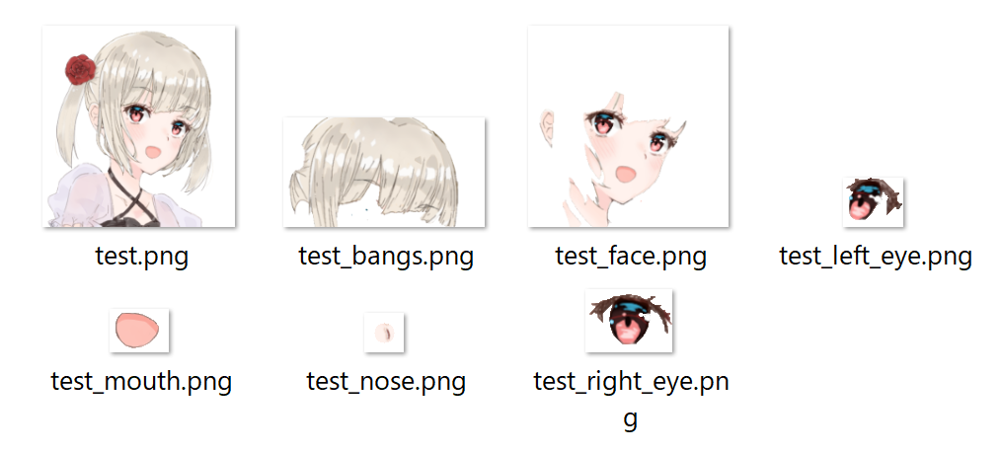
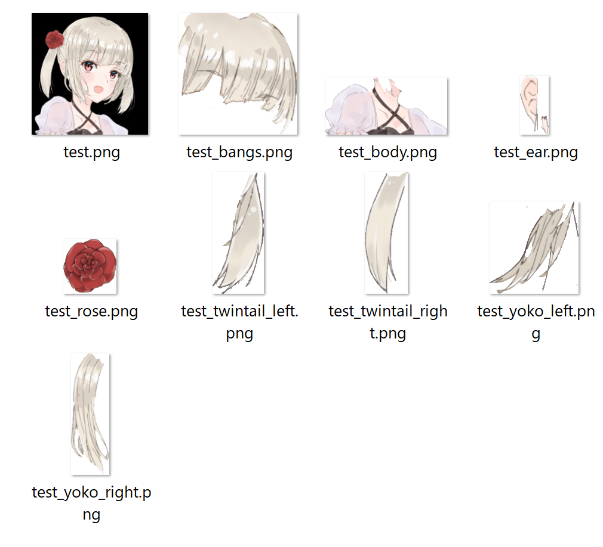

# キャラクター画像の顔パーツ自動分割

## 概要
Live2D制作の前準備である、キャラクター画像の"顔パーツをそれぞれのレイヤーに分割する"という作業を効率化するためのツールを作成しました。

### 作成したツールを用いてLive2Dでイラストを動かした様子
作成したツールを用いて左下の画像の顔パーツをそれぞれ切り取り、Live2D制作をし、イラストを動かした様子を右下に示します。
眉毛や二重線など、このツールで細かく切り取りができなかった部分は、Clip Studio Paintで手動で切り取りを行いました。  
作成したツールを用いてLive2D制作をしたところ、数日単位で作業効率を向上させることに成功しました。

  

## 目的
Live2Dを制作するためには、キャラクターイラストの目、口、髪の毛、などのパーツを予め別々のレイヤーに分割したファイルを用意する必要があります。しかし、レイヤー分けしていない既存の画像をLive2Dで動かしたい場合には、手作業でパーツごとにレイヤー分けをする必要があります。その作業はとても手間が掛かるため、対話的前景領域抽出のGrabCutのアルゴリズムとアニメ画像の顔認識のプログラムをベースとして、目、鼻、口などの顔パーツを認識し、自動で切り取りを行うことで、Live2D制作の効率化を目的としました。

## 機能一覧
- grabcut_auto.py - [grabcutのプログラム](https://github.com/opencv/opencv/blob/master/samples/python/grabcut.py)（切り取る範囲をマウスで選択・描写による前景と背景の調整)をベースとして、以下の機能を追加しました。
    - 顔パーツ(右目、左目、鼻、口、前髪、顔)を顔認識によって認識し、前景領域抽出を行う機能  
    - 出力画像をクロップして、それぞれのパーツごとの名前を付けて透過で保存する機能  
    - 目の切り取りを選択後、白目部分も切り取り可能に  
    - 鼻の自動切り取り  
    - コマンドラインで顔パーツを指定しなかった場合、切り取る範囲を手動で選択
    - 出力結果をパーツ名を付けて保存、顔パーツを指定しなかった場合、名前を付けて保存

- landmark.py - [アニメ顔用のランドマーク検出プログラム](https://github.com/kanosawa/anime_face_landmark_detection) をベースとして、検出した顔ランドマークの座標をもとに、それぞれのパーツごとの座標設定を追加しました。
    - 顔パーツ(右目、左目、鼻、口、顔、前髪、顔)それぞれの座標設定
    - 四角で囲む座標4点を設定

## デモリールと使い方
#### デモリール1：grabcut_auto.pyを実行し、右目、左目、鼻、口、前髪の前景領域抽出を行っている様子

#### デモリール2：手動で任意のパーツを切り取り、髪飾り、ツインテール右、ツインテール左の前景領域抽出を行っている様子

#### 出力結果：パーツごとにクロップして保存されたファイル
 

#### 使い方
コマンドラインにて以下を入力します。抽出する顔パーツは"right_eye", "left_eye", "nose", "mouth", "face", "bangs"のうちのどれかを選んで入力します。顔パーツを指定しないで実行した場合、右ドラッグで切り取りする範囲を選択します。保存するときは

    `python grabcut_auto.py <画像ファイル名> <抽出する顔パーツ>`   
    
    1.入力ウィンドウと出力ウィンドウが開きます。  
    2.入力ウィンドウ上で、抽出する顔パーツが矩形で囲まれます。  
    3.'n'を数回押すことによって前景抽出を行います。  
    4.以下のキーを入力し、前景領域と背景領域をマウスによる描写で選択し、'n'を押すことで抽出したい部分を調整することができます。  

Key '0' - 明確な背景領域をマウスで描写  
Key '1' - 明確な前景領域をマウスで描写  
Key '2' - 曖昧な背景領域をマウスで描写  
Key '3' - 曖昧な前景領域をマウスで描写  
key '4' - 白目を前景抽出する  
key '5' - "nose"を選択して鼻を前景抽出する  
Key 'n' - 前景抽出をアップデートする  
Key 'r' - リセット  
Key 's' - 出力を保存  
key 'q' - 終了

## 制作期間、担当箇所など
研究室仮配属の制作課題にて3人チームで作成しました。
- 制作期間
    - 約2か月
- 主な担当箇所
    - 鼻、前髪、顔の座標設定、切り取り
    - key'5'により鼻の前景領域を自動で抽出し、クロップして保存する機能
    - 主な保存機能（透過保存、出力画像の保存、名前を付けて保存など）
    - コマンドラインで顔パーツを選択しなかった場合、手動で切り取りを行う処理
    - 使用したイラストの制作
    - Live2Dの制作
    
## 工夫した点
- GrabCutのプログラムをベースとして、アニメ画像専用の顔認識を用いて顔のパーツを認識し、自動で切り取りを行えるようにしました。
- コマンドラインでパーツを指定しなかった場合、手動で切り取り範囲を設定し、任意のパーツ名を付けて保存できるようにしました。
- 鼻を選択したときに、選択範囲が小さすぎて抽出を行うことができなかったため、'5'を押すことで鼻部分を丸く前景領域にできるようにしました。

## 作るにあたって苦労した点
- 今までPythonに殆ど触れたことがなく、最初はPythonやOpenCVの開発環境も整っていなかったため、なかなかうまくいかずに苦戦しました。そのため、一から調べながらセットアップをし、この機能を実現するためにはどんな手法があるかなどをチームで相談しながら進めていきました。  
- landmarkのプログラムによって左下の図のように顔ランドマークの座標を取得することが出来ました。しかし、その座標を用いた矩形の座標設定が、使用する画像によって少しずれがあるため、それを微調整することが大変でした。眉毛や耳も座標を取得していたため、切り取りを行えるようにしようとしたのですが、眉毛は前景領域抽出の範囲が小さすぎて抽出を行えなかったため、眉毛の切り取りは自動化できませんでした。耳の座標は使用する画像によって位置が曖昧だったため、耳の切り取りも自動化できませんでした。  
- 目や髪に隠れている肌部分は、Live2Dで瞬きや髪の揺れの動きを付けるとペイントされていない部分が出てしまうため、肌部分は右下の図のように加筆しなくてはいけません。そのイラスト加工も自動で行うために、このツールで切り取ったマスク画像を使って自動で肌色を塗るというツールも作ったのですが、手作業で加筆したほうが早かったため、折角作ったけれどもボツになってしまったことが残念でした。

|||
|---------------------------------|--------------------------------|
|ランドマーク座標を取得したときの様子|　　加筆が必要な肌部分|

## 使用言語、環境
- python 3.7.6  
- Visual Studio 2017  
- Windows 10    

## 必要条件  
- opencv-python  
- torch-python
- [checkpoint_landmark_191116.pth.tar](https://drive.google.com/file/d/1NckKw7elDjQTllRxttO87WY7cnQwdMqz/view)(顔検出の為のカスケードファイル)
